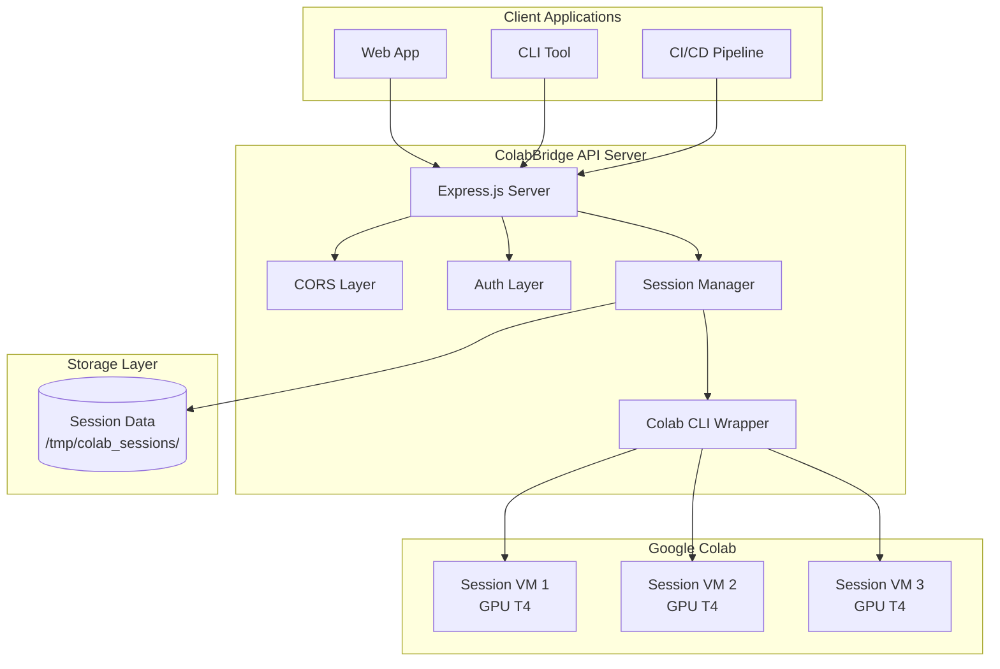
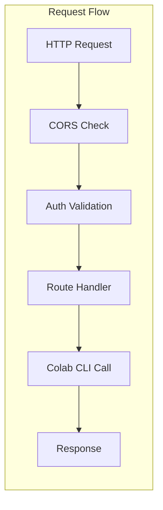
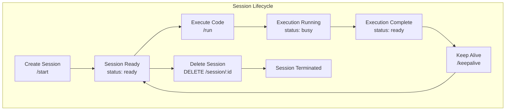
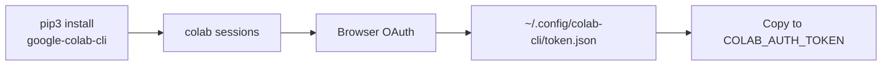
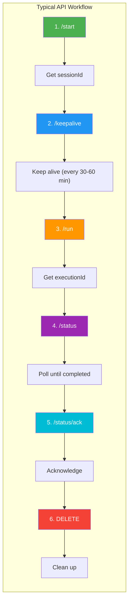
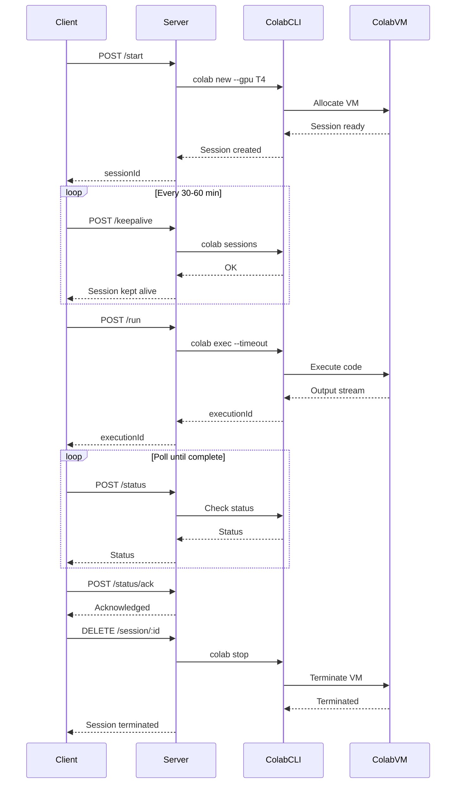
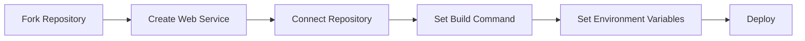

# ColabBridge

[](https://github.com/kushalkumarj2006/ColabBridge/blob/main/LICENSE)
[](https://colabbridge-jyba.onrender.com/health)
[](https://github.com/kushalkumarj2006/ColabBridge/commits/main)
[](https://github.com/kushalkumarj2006/ColabBridge)

> A REST API wrapper around Google Colab CLI that enables remote execution of Python code on Colab VMs

---

## 📋 Table of Contents

- [Overview](#overview)
- [Features](#features)
- [Architecture](#architecture)
- [API Endpoints](#api-endpoints)
- [Environment Variables](#environment-variables)
- [Installation](#installation)
- [Authentication](#authentication)
- [Usage Examples](#usage-examples)
- [Workflow](#workflow)
- [Error Handling](#error-handling)
- [Limits](#limits)
- [Deployment](#deployment)

---

## Overview

**ColabBridge** is a Node.js/Express API server that acts as a bridge between your applications and Google Colab. It enables remote execution of Python code on Colab virtual machines (VMs) with GPU support, making it ideal for:

- 🧠 AI/ML model training and inference
- 📊 Data processing pipelines
- 🤖 Automated Python script execution
- 🌐 Integration with web applications
- 🔄 CI/CD pipelines requiring GPU compute

---

## Features

| Feature | Description |
|---------|-------------|
| **Session Management** | Create, list, status, keep-alive, and delete Colab sessions |
| **Code Execution** | Execute Python code on Colab VMs with streaming output |
| **GPU Support** | Automatic T4 GPU allocation for each session |
| **Keep-Alive** | Automatic session keep-alive to prevent idle termination |
| **Session Data** | Persistent storage of execution history and outputs |
| **Health Checks** | Comprehensive health monitoring endpoints |

### Technical Highlights

- 🔒 **Secure Authentication** - API key-based authentication with multiple header/body formats
- 🌍 **CORS Support** - Configurable cross-origin resource sharing
- 🧹 **Memory Management** - Automatic cleanup of completed executions and hanging processes
- 🛑 **Graceful Shutdown** - Clean session termination on server shutdown
- 🔍 **Environment Aware** - Auto-detects Colab CLI binary (Python module or standalone)

---

## Architecture







---

## API Endpoints

### Public Endpoints (No Authentication)

| Method | Endpoint | Description |
|--------|----------|-------------|
| `GET` | `/health` | Full health check with detailed server status |
| `GET` | `/health/simple` | Simple health check |
| `GET` | `/help` | Complete API documentation |
| `GET` | `/sessions` | List all active sessions |
| `GET` | `/sessions/:identifier` | Get detailed session information |

### Protected Endpoints (API Secret Required)

| Method | Endpoint | Description |
|--------|----------|-------------|
| `POST` | `/start` | Create a new Colab session with GPU T4 |
| `POST` | `/keepalive` | Keep a session alive (prevent idle timeout) |
| `POST` | `/run` | Execute Python code on a session |
| `POST` | `/status` | Check execution status |
| `POST` | `/status/ack` | Acknowledge execution completion to free memory |
| `DELETE` | `/session/:sessionId` | Delete/terminate a session |

### Authentication Methods

Send the API secret via:

```bash
# Option 1: Request Body
{
  "api_secret": "your-secret-key"
}

# Option 2: HTTP Header
api-secret: your-secret-key

# Option 3: HTTP Header (Alternative)
x-api-secret: your-secret-key
```

---

## Environment Variables

| Variable | Description | Default |
|----------|-------------|---------|
| **API_SECRET** | API secret for authentication | _Required_ |
| **COLAB_AUTH_TOKEN** | Google Colab authentication token (JSON) | _Required_ |
| **COLAB_REFRESH_DATA** | Refresh data extracted from token | _Optional_ |
| **PORT** | Server port | 3000 |
| **NODE_ENV** | Environment mode (development/production) | development |
| **LOG_LEVEL** | Logging verbosity | info |
| **DEBUG_ENABLED** | Enable debug mode | true |

### Session Settings

| Variable | Description | Default |
|----------|-------------|---------|
| **MAX_SESSIONS** | Maximum concurrent sessions | 3 |
| **SESSION_TIMEOUT** | Session idle timeout (milliseconds) | 3 hours |
| **SESSIONS_BASE_DIR** | Session storage directory | /tmp/colab_sessions |
| **PERSIST_SESSION_DATA** | Persist session data to disk | true |
| **CLEANUP_INTERVAL** | Idle session cleanup interval (milliseconds) | 1 hour |

### Execution Settings

| Variable | Description | Default |
|----------|-------------|---------|
| **EXECUTION_TIMEOUT** | Execution timeout (seconds) | 2 hours |
| **MAX_CODE_SIZE** | Maximum code size (bytes) | 3 MB |
| **MAX_CODE_LENGTH** | Maximum code length (characters) | 100,000 |
| **MAX_RETRY_ATTEMPTS** | Retry attempts for failed executions | 3 |
| **STREAMING_ENABLED** | Enable streaming output | true |

### Other Settings

| Variable | Description | Default |
|----------|-------------|---------|
| **COMPLETED_EXECUTIONS_TTL** | Keep completed executions in memory (milliseconds) | 20 minutes |
| **POLL_INTERVAL** | Recommended polling interval (milliseconds) | 10 seconds |
| **HANGING_PROCESS_CLEANUP_INTERVAL** | Hanging process cleanup interval (milliseconds) | 15 minutes |

---

## Installation

### Prerequisites

- **Node.js** >= 18.0.0
- **Python** >= 3.12 (for Colab CLI)
- **Google Colab CLI** (`google-colab-cli`)

### Setup

```bash
# Clone the repository
git clone https://github.com/kushalkumarj2006/ColabBridge.git
cd ColabBridge/render

# Install Node dependencies
npm install

# Install Colab CLI (Linux/macOS only)
pip3 install google-colab-cli

# Configure environment
cp .env.example .env
# Edit .env with your configuration

# Start the server
npm start
```

### Render Deployment

```bash
# Build command
npm install && pip3 install --upgrade pip && pip3 install google-colab-cli

# Start command
node server.js
```

---

## Authentication

### Getting the Colab Authentication Token



```bash
# Install Colab CLI
pip3 install google-colab-cli

# Authenticate (opens browser for OAuth)
colab sessions

# Get the token
cat ~/.config/colab-cli/token.json

# Copy the entire JSON content to COLAB_AUTH_TOKEN
```

The token JSON should look like:

```json
{
  "token": "ya29.a0AT...........mKcA0206",
  "refresh_token": "1//0g4sU.............vhxoCU5Xs",
  "token_uri": "https://oauth2.googleapis.com/token",
  "client_id": "764086............di341hur.apps.googleusercontent.com",
  "client_secret": "d-FL9...........HD0Ty",
  "scopes": [
    "openid",
    "https://www.googleapis.com/auth/userinfo.profile",
    "https://www.googleapis.com/auth/userinfo.email",
    "https://www.googleapis.com/auth/cloud-platform",
    "https://www.googleapis.com/auth/colaboratory",
    "https://www.googleapis.com/auth/drive.file"
  ],
  "universe_domain": "googleapis.com",
  "account": "",
  "expiry": "2026-06-16T10:40:31.096124Z"
}
```

---

## Usage Examples

### 1. Create a Session

```bash
curl -X POST https://your-server.com/start \
  -H "Content-Type: application/json" \
  -d '{"api_secret": "your-secret-key"}'
```

**Response:**
```json
{
  "success": true,
  "sessionId": "a1b2c3d4e5f6g7h8i9j0k1l2m3n4o5p6...",
  "authUrl": null,
  "expiresIn": 10800000,
  "activeSessions": 1,
  "maxSessions": 3,
  "message": "Session created successfully"
}
```

### 2. Check Session Status

```bash
curl -X GET https://your-server.com/sessions/a1b2c3d4
```

**Response:**
```json
{
  "session": {
    "sub": "a1b2c3d4",
    "sessionId": "a1b2c3d4e5f6...",
    "colabSession": "colab_a1b2c3d4e5f6",
    "status": "ready",
    "createdAt": "2026-06-17T03:51:55.443Z",
    "lastActivity": "2026-06-17T03:54:57.246Z",
    "activeMinutes": "4.95",
    "hasCurrentExecution": false,
    "folder": "/tmp/colab_sessions/a1b2c3d4..."
  },
  "sessionData": {
    "cells": [...],
    "totalCells": 12,
    "totalExecutions": 6
  },
  "currentExecution": null,
  "memoryUsage": {
    "rss": "71.21 MB",
    "heapTotal": "13.21 MB",
    "heapUsed": "11.28 MB"
  }
}
```

### 3. Execute Python Code

```bash
curl -X POST https://your-server.com/run \
  -H "Content-Type: application/json" \
  -d '{
    "api_secret": "your-secret-key",
    "sessionId": "a1b2c3d4e5f6...",
    "code": "print(\"Hello World\")",
    "cellNo": 1
  }'
```

**Response:**
```json
{
  "status": "processing",
  "sessionId": "a1b2c3d4e5f6...",
  "executionId": "f1e2d3c4b5a6",
  "pollInterval": 10000,
  "message": "Code execution started. Poll /status for results."
}
```

### 4. Check Execution Status

```bash
curl -X POST https://your-server.com/status \
  -H "Content-Type": application/json" \
  -d '{
    "api_secret": "your-secret-key",
    "sessionId": "a1b2c3d4e5f6...",
    "executionId": "f1e2d3c4b5a6"
  }'
```

**Response (Completed):**
```json
{
  "status": "completed",
  "output": "Hello World\n",
  "error": "",
  "executionTime": 1234
}
```

### 5. Keep Session Alive

```bash
curl -X POST https://your-server.com/keepalive \
  -H "Content-Type: application/json" \
  -d '{
    "api_secret": "your-secret-key",
    "sessionId": "a1b2c3d4e5f6..."
  }'
```

### 6. Delete Session

```bash
curl -X DELETE https://your-server.com/session/a1b2c3d4e5f6... \
  -H "api-secret: your-secret-key"
```

---

## Workflow





---

## Error Handling

| Code | Description | Solution |
|------|-------------|----------|
| **401** | Invalid API secret | Check the API secret in request body or headers |
| **404** | Session not found | Create a new session with `/start` |
| **409** | Session busy | Wait for current execution to complete |
| **400** | Missing required fields | Include all required fields (sessionId, code, cellNo) |
| **500** | Internal server error | Check server logs for details |

### Common Errors

**Connection Lost during execution:**
- Occurs when long-running commands (e.g., `apt-get update`) take too long without output
- **Solution:** Run long installations in the background using `nohup`

```python
# Instead of:
subprocess.run("apt-get update && apt-get install -y zstd", shell=True)

# Use:
subprocess.Popen(
    "nohup bash -c 'apt-get update && apt-get install -y zstd' > /tmp/install.log 2>&1 &",
    shell=True
)
```

---

## Limits

| Setting | Value |
|---------|-------|
| **Max Sessions** | 3 (configurable) |
| **Session Timeout** | 3 hours |
| **Execution Timeout** | 2 hours |
| **Max Code Size** | 3 MB |
| **Max Code Length** | 100,000 characters |
| **Polling Interval** | 10 seconds |

---

## Deployment

### Deploy on Render



**Build Command:**
```bash
npm install && pip3 install --upgrade pip && pip3 install google-colab-cli
```

**Start Command:**
```bash
npm start
```

### Deploy Locally

```bash
# Install dependencies
npm install
pip3 install google-colab-cli

# Set environment variables
export API_SECRET=your-secret-key
export COLAB_AUTH_TOKEN='{"token": "...", ...}'

# Start server
npm start
```

### Docker Deployment

```dockerfile
FROM node:18-slim

RUN apt-get update && apt-get install -y python3 python3-pip
RUN pip3 install google-colab-cli

WORKDIR /app
COPY render/package*.json ./
RUN npm install
COPY render/ .

EXPOSE 3000
CMD ["node", "server.js"]
```

---

## 📝 License

MIT License - see [LICENSE](LICENSE) for details.

---

## 🙏 Acknowledgments

- Built with [Express.js](https://expressjs.com/)
- Powered by [Google Colab CLI](https://github.com/googlecolab/google-colab-cli)
- Deployed on [Render](https://render.com/)

---

## 📞 Support

For issues or questions:
- Open an issue on [GitHub](https://github.com/kushalkumarj2006/ColabBridge/issues)
- Check the [help endpoint](https://colabbridge-jyba.onrender.com/help) for API documentation

---

<div align="center">

**Built with ❤️ by Kushal Kumar J**

[](https://github.com/kushalkumarj2006/ColabBridge)
[](https://colabbridge-jyba.onrender.com)

</div>


correct now?
